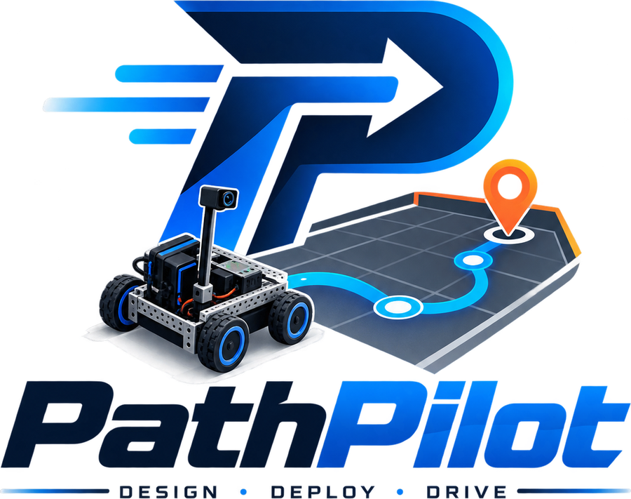

<p align="center">
  
</p>

<p align="center"><strong>FTC autonomous path planner.</strong> Design a path on the field, get a self-contained OpMode.</p>

---

PathPilot is a single-page tool for planning FTC autonomous routines. You place waypoints
on an accurate field map, attach actions to them, and it generates a complete Java OpMode
you paste into OnBot Java. Odometry, motion control, vision, and mechanism macros all live
inside the generated file — nothing else needs to be on the Control Hub.

It pairs with [BotBuilder](../../../botbuilder), which owns the robot configuration and
exports a **robot profile** that PathPilot reads.

## Live

- **PathPilot** — https://your-pathpilot.vercel.app
- **BotBuilder** — https://your-botbuilder.vercel.app

## What it does

**Accurate field geometry.** The DECODE 2025-2026 field is transcribed from the Competition
Manual (Team Update 32, figures 9-2/9-3/9-5/9-18). Goals in the far corners at 45°, both
launch zones, base and loading zones, secret tunnels, spike marks with staged artifacts,
AprilTags 20 and 24, and the obelisk.

**Rule checking as you build.** The start pose is validated against **G304** — over a launch
line, touching your own goal or the perimeter, fully inside your alliance's columns — and
it tells you which sub-rule fails. Robot-versus-structure collisions are checked as a swept
path, not just at the waypoints, so a leg that clips the goal between two legal points is
caught.

**Timing against the clock.** Each leg is estimated with a trapezoidal profile and totalled
against the 30-second AUTO window.

**Code that compiles.** The generated OpMode is self-contained: two-pod-plus-IMU odometry,
a stop-at-waypoint PID controller, Limelight helpers, and your mechanism macros as private
methods. One file, one paste.

## The season library

A season is **pure JSON** — geometry, obstacles, rules, actions. No functions, no code, so
importing a season pack from another team cannot execute anything. Size-dependent values
like start presets are arithmetic expressions (`"48 + r"`), evaluated by a parser that only
understands numbers and `+ − × ÷`.

```
seasons/decode-2025.json     the shipped DECODE pack
```

Load a pack from the **Field data** tab. Every start preset is re-checked against the pack's
own rules at several robot sizes on import, and failures are reported rather than silently
accepted.

Adding a season still means reading the game manual carefully. Measurements taken from
figures need a human eye, and a wrong number produces a path that misses rather than an
error.

## Using it

1. **Load a robot profile** — export it from BotBuilder, load it here. Without one, hardware
   names and odometry constants fall back to defaults.
2. **Pick your alliance and start preset.**
3. **Click the field** to add waypoints. Drag to move, click to edit.
4. **Attach actions** — waits, AprilTag alignment, or macros from your profile.
5. **Tune motion** in the Motion tab if you have measured velocity figures.
6. **Copy the code** from the Code tab into OnBot Java as one file, and Build.

Paths save as JSON, stamped with the season so a DECODE path can't silently load against a
different field.

## Motion model

**Stop-at-waypoint.** Each leg accelerates, cruises, decelerates, and settles inside
tolerance before the next begins. No blending between waypoints.

Slower than a spline follower, far easier to tune, and it fails predictably. Translation and
rotation run simultaneously, so a leg costs whichever takes longer.

The generated code includes a **runaway guard**: if a leg never once gets closer to its
target and the error grows past a margin, it stops. That is the signature of an odometry pod
reading the wrong sign, and it is the difference between four inches of travel and eight
feet. A failed leg also stops the rest of the path, because every later waypoint is measured
from a position the robot is not at.

## Honest status

The pipeline generates code that compiles, and the odometry maths is verified in simulation
— a 48" square closes to a thousandth of an inch. **None of it is validated on a competition
field yet.**

Specifically:

- **PID gains are starting guesses.** They will compile and move; they are not tuned. Raise
  `TRANS_KP` until it overshoots, back off, add `TRANS_KD`.
- **`MAX_VELOCITY` and `MAX_ACCEL` are estimates.** They drive the timing display and the
  per-leg timeout, so wrong values give wrong predictions.
- **Four field measurements were taken from manual figures** rather than stated dimensions:
  base zone placement, classifier ramp length, spike mark offset from the wall, and the goal
  footprint. Worth checking against a real field.
- **Mecanum only.** The generated kinematics assume a holonomic drivetrain. Tank would crab
  off course.
- **Limelight helpers are untested on hardware.** They use API calls proven in TeleOp, but
  not in a blocking autonomous loop.

Odometry must be calibrated before any of it means anything. BotBuilder generates a
calibration OpMode that measures real ticks-per-inch and pod offsets; type the results back
into BotBuilder and re-export the profile.

## Repo layout

```
index.html                 the whole app, single file
seasons/
  decode-2025.json         reference season pack
assets/
  pathpilot-mark.png       512px icon
  pathpilot-logo.png       full lockup
api/                       reserved for a future AI proxy
```

No build step. `index.html` loads React, ReactDOM, and Babel from a CDN and compiles in the
browser. Open it from disk and it works.

## Deploying

Vercel serves `index.html` at the root, so importing this repo is enough — no build command,
no output directory. GitHub Pages works the same way.

## Field coordinates

```
(0,0) is the bottom-left corner of the field, seen from the audience.
+X runs right. +Y runs away from the audience.
heading 0 faces +Y and increases CLOCKWISE, so 90 faces +X.
```

The IMU reports yaw counter-clockwise-positive; the generated code converts in one place.

## Licence

MIT. Built for FTC Team 24052.
